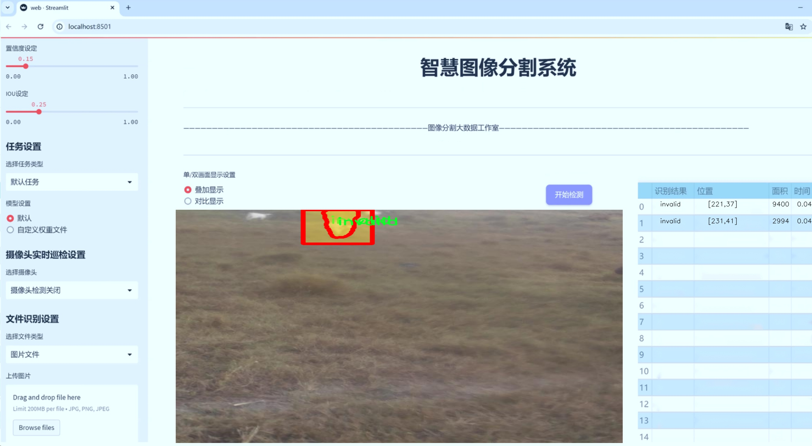
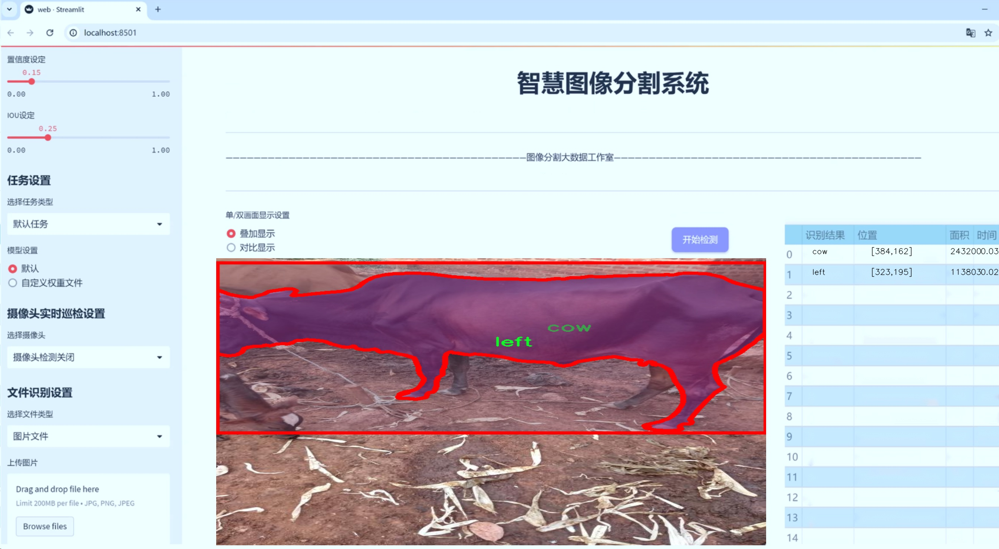
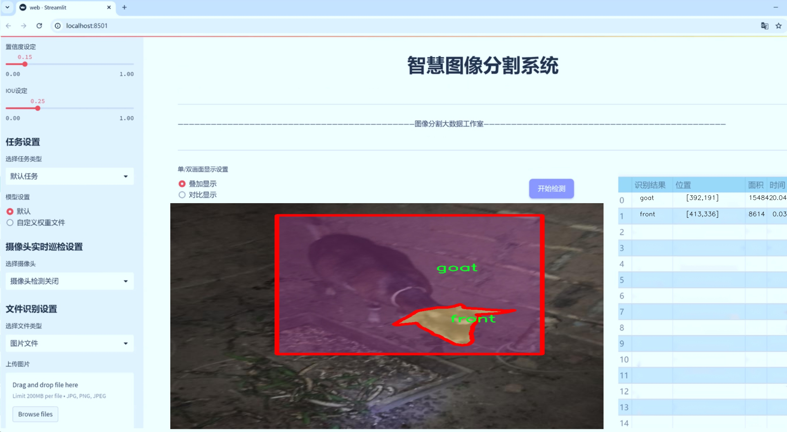
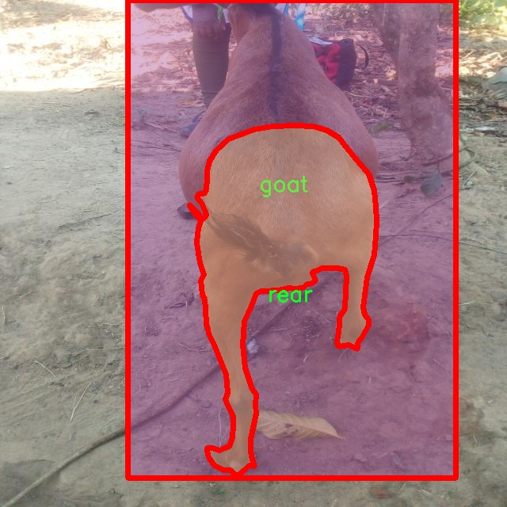
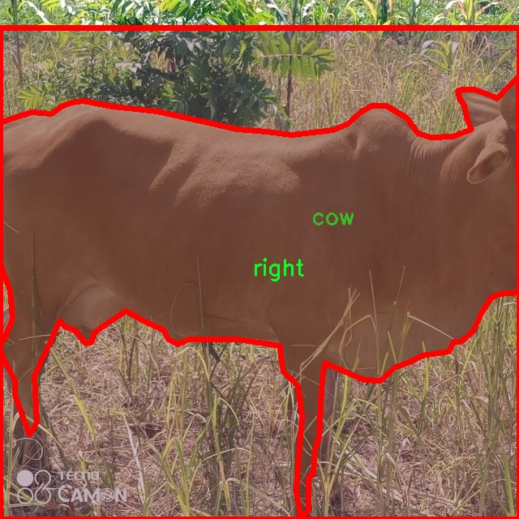
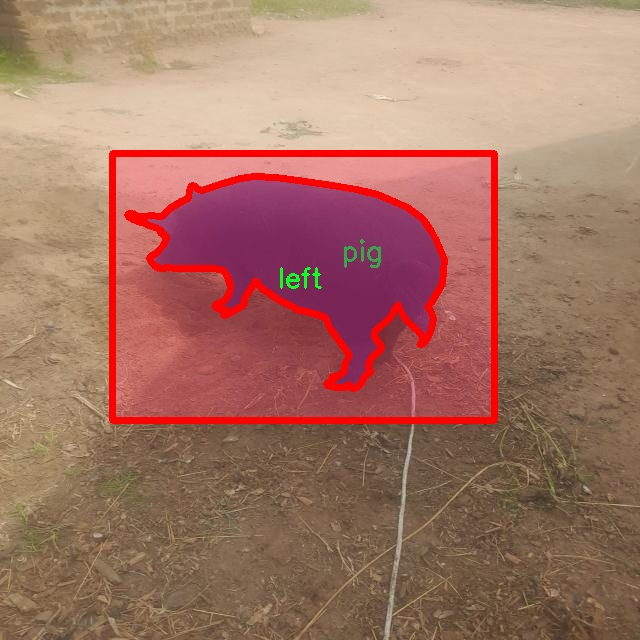
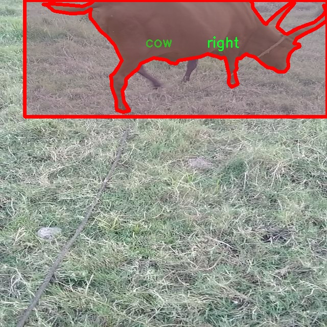
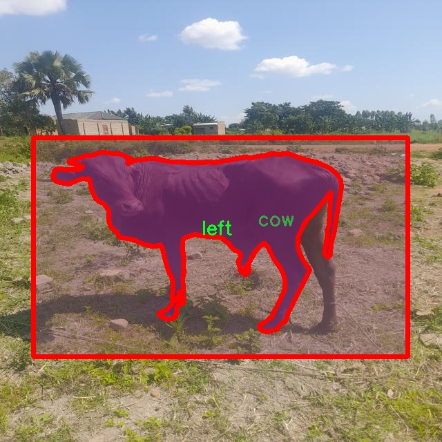

# 牲畜图像分割系统： yolov8-seg-C2f-Parc

### 1.研究背景与意义

[参考博客](https://gitee.com/YOLOv8_YOLOv11_Segmentation_Studio/projects)

[博客来源](https://kdocs.cn/l/cszuIiCKVNis)

研究背景与意义

随着农业现代化的不断推进，牲畜养殖业在全球范围内日益受到重视。牲畜的健康管理、生产效率提升以及资源的合理利用都依赖于对牲畜的精准监测与管理。传统的牲畜监测方法往往依赖人工观察，效率低下且容易受到人为因素的影响。近年来，计算机视觉技术的快速发展为牲畜监测提供了新的解决方案。特别是基于深度学习的图像分割技术，能够实现对牲畜的自动识别与分类，为养殖业的智能化转型提供了强有力的支持。

在众多图像分割算法中，YOLO（You Only Look Once）系列模型因其高效的实时检测能力而受到广泛关注。YOLOv8作为该系列的最新版本，具备了更高的准确性和更快的处理速度，适用于复杂的农业环境。然而，尽管YOLOv8在目标检测方面表现出色，但在细粒度的实例分割任务中仍存在一定的局限性。为此，基于改进YOLOv8的牲畜图像分割系统的研究显得尤为重要。

本研究所使用的数据集M-vet包含2000张图像，涵盖了10个类别的牲畜，包括牛、羊、猪、兔子等。这些类别不仅具有较高的经济价值，而且在养殖管理中各自面临不同的挑战。通过对这些牲畜进行实例分割，可以实现对每一只动物的独立识别，从而为后续的健康监测、行为分析和饲养管理提供数据支持。此外，数据集中包含的不同视角（前、后、左、右）和状态（有效、无效）也为模型的训练提供了丰富的样本，有助于提高模型的鲁棒性和适应性。

研究的意义不仅体现在技术层面，更在于其对农业生产方式的深远影响。通过构建基于改进YOLOv8的牲畜图像分割系统，可以有效提高牲畜监测的自动化水平，降低人工成本，提升管理效率。同时，该系统能够实时监测牲畜的健康状况，及时发现潜在的疾病风险，从而提高牲畜的存活率和生产效益。此外，精确的图像分割技术还可以为养殖场提供数据支持，帮助农户优化饲养策略，实现资源的合理配置。

综上所述，基于改进YOLOv8的牲畜图像分割系统的研究不仅具有重要的学术价值，也为实际应用提供了切实可行的解决方案。通过推动这一领域的研究进展，将为农业智能化发展提供新思路，助力实现可持续的农业生产模式。

### 2.图片演示







注意：本项目提供完整的训练源码数据集和训练教程,由于此博客编辑较早,暂不提供权重文件（best.pt）,需要按照6.训练教程进行训练后实现上图效果。

### 3.视频演示

[3.1 视频演示](https://www.bilibili.com/video/BV1AfUNYUEMd/)

### 4.数据集信息

##### 4.1 数据集类别数＆类别名

nc: 10
names: ['cow', 'front', 'goat', 'invalid', 'left', 'pig', 'rabbit', 'rear', 'right', 'sheep']


##### 4.2 数据集信息简介

数据集信息展示

在本研究中，我们采用了名为“M-vet”的数据集，以训练和改进YOLOv8-seg的牲畜图像分割系统。该数据集专注于农业和畜牧业领域，旨在通过精确的图像分割技术，提高牲畜的识别和管理效率。M-vet数据集包含10个不同的类别，具体包括：牛（cow）、前视（front）、山羊（goat）、无效（invalid）、左侧（left）、猪（pig）、兔子（rabbit）、后视（rear）、右侧（right）和羊（sheep）。这些类别的选择不仅涵盖了常见的家畜种类，还考虑到了不同的视角和状态，为模型的训练提供了丰富的多样性。

在数据集的构建过程中，研究团队进行了广泛的图像采集，确保每个类别都具有足够的样本量和多样性。牛、羊、猪等常见牲畜的图像来自不同的环境和条件，包括农场、牧场以及其他相关场所。这种多样化的图像来源有助于模型在不同的场景下进行有效的识别和分割。此外，前视、左侧、右侧和后视等不同角度的图像，使得模型能够学习到牲畜在各种姿态下的特征，增强了其鲁棒性。

在数据集的标注过程中，采用了高精度的分割标注技术，确保每个类别的边界清晰可辨。无效类别的引入则是为了帮助模型学习如何处理不完整或模糊的图像，这对于实际应用中的图像处理至关重要。通过对无效图像的标注，模型能够更好地适应现实世界中可能遇到的各种挑战，提高其在复杂环境下的表现。

M-vet数据集的构建不仅考虑了图像的数量和质量，还注重了数据的平衡性。每个类别的样本数量经过精心设计，以避免模型在训练过程中出现偏向某一类别的现象。这种平衡性确保了模型在识别和分割各类牲畜时的公平性和准确性，使其能够在实际应用中更好地服务于农业生产和管理。

通过使用M-vet数据集，我们的目标是显著提升YOLOv8-seg在牲畜图像分割任务中的性能。该数据集的多样性和高质量标注将为模型提供强有力的支持，使其能够在实际应用中实现更高的精度和效率。随着技术的不断进步，图像分割在农业领域的应用前景广阔，M-vet数据集的使用将为未来的研究和实践奠定坚实的基础。通过不断优化和改进，我们期待该系统能够为牲畜管理提供更加智能化的解决方案，推动农业现代化的发展。











### 5.项目依赖环境部署教程（零基础手把手教学）

[5.1 环境部署教程链接（零基础手把手教学）](https://www.bilibili.com/video/BV1jG4Ve4E9t/?vd_source=bc9aec86d164b67a7004b996143742dc)


[5.2 安装Python虚拟环境创建和依赖库安装视频教程链接（零基础手把手教学）](https://www.bilibili.com/video/BV1nA4VeYEze/?vd_source=bc9aec86d164b67a7004b996143742dc)

### 6.手把手YOLOV8-seg训练视频教程（零基础手把手教学）

[6.1 手把手YOLOV8-seg训练视频教程（零基础小白有手就能学会）](https://www.bilibili.com/video/BV1cA4VeYETe/?vd_source=bc9aec86d164b67a7004b996143742dc)


按照上面的训练视频教程链接加载项目提供的数据集，运行train.py即可开始训练



     Epoch   gpu_mem       box       obj       cls    labels  img_size
     1/200     0G   0.01576   0.01955  0.007536        22      1280: 100%|██████████| 849/849 [14:42<00:00,  1.04s/it]
               Class     Images     Labels          P          R     mAP@.5 mAP@.5:.95: 100%|██████████| 213/213 [01:14<00:00,  2.87it/s]
                 all       3395      17314      0.994      0.957      0.0957      0.0843

     Epoch   gpu_mem       box       obj       cls    labels  img_size
     2/200     0G   0.01578   0.01923  0.007006        22      1280: 100%|██████████| 849/849 [14:44<00:00,  1.04s/it]
               Class     Images     Labels          P          R     mAP@.5 mAP@.5:.95: 100%|██████████| 213/213 [01:12<00:00,  2.95it/s]
                 all       3395      17314      0.996      0.956      0.0957      0.0845

     Epoch   gpu_mem       box       obj       cls    labels  img_size
     3/200     0G   0.01561    0.0191  0.006895        27      1280: 100%|██████████| 849/849 [10:56<00:00,  1.29it/s]
               Class     Images     Labels          P          R     mAP@.5 mAP@.5:.95: 100%|███████   | 187/213 [00:52<00:00,  4.04it/s]
                 all       3395      17314      0.996      0.957      0.0957      0.0845


### 7.50+种全套YOLOV8-seg创新点加载调参实验视频教程（一键加载写好的改进模型的配置文件）

[7.1 50+种全套YOLOV8-seg创新点加载调参实验视频教程（一键加载写好的改进模型的配置文件）](https://www.bilibili.com/video/BV1Hw4VePEXv/?vd_source=bc9aec86d164b67a7004b996143742dc)

### YOLOV8-seg算法简介

原始YOLOv8-seg算法原理

YOLOv8-seg算法是Ultralytics公司在2023年推出的YOLO系列中的最新版本，旨在提升目标检测和图像分割的性能。作为YOLO系列的延续，YOLOv8-seg不仅在速度和准确性上进行了优化，还在网络结构和损失函数设计上进行了创新，尤其是针对图像分割任务的特定需求进行了调整。该算法的设计理念是快速、准确且易于使用，使其成为各种视觉任务的理想选择。

YOLOv8-seg的网络结构可以分为几个主要部分：输入层、主干网络（Backbone）、颈部网络（Neck）和头部网络（Head）。在输入层，YOLOv8-seg默认接受640x640的图像尺寸，但为了适应不同长宽比的图像，算法采用自适应缩放策略，以提高检测和推理的速度。这种策略不仅减少了填充的需要，还降低了信息冗余，从而提高了模型的整体性能。此外，YOLOv8-seg在训练过程中引入了Mosaic数据增强技术，旨在通过将多张图像拼接成一张来增加训练样本的多样性，从而提升模型的鲁棒性和泛化能力。

在主干网络部分，YOLOv8-seg对YOLOv5中的C3模块进行了替换，采用了C2f模块。C2f模块的设计灵感来源于YOLOv7中的ELAN结构，旨在通过引入更多的跳层连接来增强梯度流的丰富性。这种设计不仅保持了模型的轻量化，还显著提高了特征提取的效率。C2f模块通过并行处理多个梯度流，使得模型在处理复杂特征时能够更好地捕捉信息，从而提升了检测精度。

颈部网络部分，YOLOv8-seg同样采用了C2f模块，并在结构上进行了简化，去除了多余的卷积连接层。这一改进使得特征融合过程更加高效，能够更好地实现多尺度特征的整合。通过这种方式，YOLOv8-seg能够更好地处理不同尺度的目标，提升了对小目标的检测能力。

在头部网络部分，YOLOv8-seg引入了解耦头的设计，分别处理分类和定位任务。与传统的耦合头结构不同，解耦头通过两个独立的分支来处理类别预测和边界框回归。这种设计使得模型在处理不同任务时能够更专注于各自的特征，从而提高了收敛速度和预测精度。此外，YOLOv8-seg采用了无锚框（Anchor-Free）的方法，直接预测目标的中心位置，而不是依赖于预设的锚框。这一创新不仅简化了模型的结构，还增强了其在不同数据集上的泛化能力。

YOLOv8-seg的损失函数设计也进行了优化，采用了任务对齐学习（Task Alignment Learning）的方法，以更好地平衡分类和定位任务的损失。通过引入分类分数和IoU的高次幂乘积作为衡量指标，YOLOv8-seg能够在训练过程中同时关注定位和分类的精度，从而实现更高的整体性能。

在实际应用中，YOLOv8-seg在COCO数据集上的表现尤为突出，展示了其在目标检测和图像分割任务中的强大能力。通过与其他YOLO系列模型的对比，YOLOv8-seg在相同模型尺寸下实现了更高的mAP（平均精度均值），并且在推理速度上也表现出色。这使得YOLOv8-seg成为实时目标检测和图像分割任务的理想选择，尤其是在需要高效处理的场景中。

总的来说，YOLOv8-seg算法通过一系列创新的设计和优化，成功地提升了目标检测和图像分割的性能。其在主干网络、颈部网络和头部网络的改进，使得模型在处理复杂场景时能够更好地捕捉和理解图像中的信息。同时，YOLOv8-seg的无锚框检测方式和任务对齐学习的损失函数设计，为模型的灵活性和准确性提供了有力支持。随着YOLOv8-seg的不断发展和应用，其在计算机视觉领域的潜力将会进一步得到挖掘，为各类视觉任务的实现提供更为强大的技术支持。


### 9.系统功能展示（检测对象为举例，实际内容以本项目数据集为准）

图9.1.系统支持检测结果表格显示

  图9.2.系统支持置信度和IOU阈值手动调节

  图9.3.系统支持自定义加载权重文件best.pt(需要你通过步骤5中训练获得)

  图9.4.系统支持摄像头实时识别

  图9.5.系统支持图片识别

  图9.6.系统支持视频识别

  图9.7.系统支持识别结果文件自动保存

  图9.8.系统支持Excel导出检测结果数据


### 10.50+种全套YOLOV8-seg创新点原理讲解（非科班也可以轻松写刊发刊，V11版本正在科研待更新）

#### 10.1 由于篇幅限制，每个创新点的具体原理讲解就不一一展开，具体见下列网址中的创新点对应子项目的技术原理博客网址【Blog】：


[10.1 50+种全套YOLOV8-seg创新点原理讲解链接](https://gitee.com/qunmasj/good)

#### 10.2 部分改进模块原理讲解(完整的改进原理见上图和技术博客链接)【如果此小节的图加载失败可以通过CSDN或者Github搜索该博客的标题访问原始博客，原始博客图片显示正常】

### Gold-YOLO简介
YOLO再升级：华为诺亚提出Gold-YOLO，聚集-分发机制打造新SOTA
在过去的几年中，YOLO系列模型已经成为实时目标检测领域的领先方法。许多研究通过修改架构、增加数据和设计新的损失函数，将基线推向了更高的水平。然而以前的模型仍然存在信息融合问题，尽管特征金字塔网络（FPN）和路径聚合网络（PANet）已经在一定程度上缓解了这个问题。因此，本研究提出了一种先进的聚集和分发机制（GD机制），该机制通过卷积和自注意力操作实现。这种新设计的模型被称为Gold-YOLO，它提升了多尺度特征融合能力，在所有模型尺度上实现了延迟和准确性的理想平衡。此外，本文首次在YOLO系列中实现了MAE风格的预训练，使得YOLO系列模型能够从无监督预训练中受益。Gold-YOLO-N在COCO val2017数据集上实现了出色的39.9% AP，并在T4 GPU上实现了1030 FPS，超过了之前的SOTA模型YOLOv6-3.0-N，其FPS相似，但性能提升了2.4%。


#### Gold-YOLO


YOLO系列的中间层结构采用了传统的FPN结构，其中包含多个分支用于多尺度特征融合。然而，它只充分融合来自相邻级别的特征，对于其他层次的信息只能间接地进行“递归”获取。

传统的FPN结构在信息传输过程中存在丢失大量信息的问题。这是因为层之间的信息交互仅限于中间层选择的信息，未被选择的信息在传输过程中被丢弃。这种情况导致某个Level的信息只能充分辅助相邻层，而对其他全局层的帮助较弱。因此，整体上信息融合的有效性可能受到限制。
为了避免在传输过程中丢失信息，本文采用了一种新颖的“聚集和分发”机制（GD），放弃了原始的递归方法。该机制使用一个统一的模块来收集和融合所有Level的信息，并将其分发到不同的Level。通过这种方式，作者不仅避免了传统FPN结构固有的信息丢失问题，还增强了中间层的部分信息融合能力，而且并没有显著增加延迟。


# 8.低阶聚合和分发分支 Low-stage gather-and-distribute branch
从主干网络中选择输出的B2、B3、B4、B5特征进行融合，以获取保留小目标信息的高分辨率特征。


低阶特征对齐模块 (Low-stage feature alignment module)： 在低阶特征对齐模块（Low-FAM）中，采用平均池化（AvgPool）操作对输入特征进行下采样，以实现统一的大小。通过将特征调整为组中最小的特征大小（ R B 4 = 1 / 4 R ） （R_{B4} = 1/4R）（R 
B4 =1/4R），我们得到对齐后的特征F a l i g n F_{align}F align 。低阶特征对齐技术确保了信息的高效聚合，同时通过变换器模块来最小化后续处理的计算复杂性。其中选择 R B 4 R_{B4}R B4 作为特征对齐的目标大小主要基于保留更多的低层信息的同时不会带来较大的计算延迟。
低阶信息融合模块(Low-stage information fusion module)： 低阶信息融合模块（Low-IFM）设计包括多层重新参数化卷积块（RepBlock）和分裂操作。具体而言，RepBlock以F a l i g n ( c h a n n e l = s u m ( C B 2 ， C B 3 ， C B 4 ， C B 5 ) ) F_{align} (channel= sum(C_{B2}，C_{B3}，C_{B4}，C_{B5}))F align (channel=sum(C B2 ，C B3 ，C B4 ，C B5 )作为输入，并生成F f u s e ( c h a n n e l = C B 4 + C B 5 ) F_{fuse} (channel= C_{B4} + C_{B5})F fuse (channel=C B4 +C B5 )。其中中间通道是一个可调整的值（例如256），以适应不同的模型大小。由RepBlock生成的特征随后在通道维度上分裂为F i n j P 3 Finj_P3Finj P 3和F i n j P 4 Finj_P4Finj P 4，然后与不同级别的特征进行融合。


# 8.高阶聚合和分发分支 High-stage gather-and-distribute branch
高级全局特征对齐模块（High-GD）将由低级全局特征对齐模块（Low-GD）生成的特征{P3, P4, P5}进行融合。


高级特征对齐模块(High-stage feature alignment module)： High-FAM由avgpool组成，用于将输入特征的维度减小到统一的尺寸。具体而言，当输入特征的尺寸为{R P 3 R_{P3}R P3 , R P 4 R_{P4}R P4 , R P 5 R_{P 5}R P5 }时，avgpool将特征尺寸减小到该特征组中最小的尺寸（R P 5 R_{P5}R P5  = 1/8R）。由于transformer模块提取了高层次的信息，池化操作有助于信息聚合，同时降低了transformer模块后续步骤的计算需求。

Transformer融合模块由多个堆叠的transformer组成，transformer块的数量为L。每个transformer块包括一个多头注意力块、一个前馈网络（FFN）和残差连接。采用与LeViT相同的设置来配置多头注意力块，使用16个通道作为键K和查询Q的头维度，32个通道作为值V的头维度。为了加速推理过程，将层归一化操作替换为批归一化，并将所有的GELU激活函数替换为ReLU。为了增强变换器块的局部连接，在两个1x1卷积层之间添加了一个深度卷积层。同时，将FFN的扩展因子设置为2，以在速度和计算成本之间取得平衡。

信息注入模块(Information injection module)： 高级全局特征对齐模块（High-GD）中的信息注入模块与低级全局特征对齐模块（Low-GD）中的相同。在高级阶段，局部特征（Flocal）等于Pi，因此公式如下所示：


### 增强的跨层信息流动 Enhanced cross-layer information flow
为了进一步提升性能，从YOLOv8 中的PAFPN模块中得到启发，引入了Inject-LAF模块。该模块是注入模块的增强版，包括了一个轻量级相邻层融合（LAF）模块，该模块被添加到注入模块的输入位置。为了在速度和准确性之间取得平衡，设计了两个LAF模型：LAF低级模型和LAF高级模型，分别用于低级注入（合并相邻两层的特征）和高级注入（合并相邻一层的特征）。它们的结构如图5(b)所示。为了确保来自不同层级的特征图与目标大小对齐，在实现中的两个LAF模型仅使用了三个操作符：双线性插值（上采样过小的特征）、平均池化（下采样过大的特征）和1x1卷积（调整与目标通道不同的特征）。模型中的LAF模块与信息注入模块的结合有效地平衡了准确性和速度之间的关系。通过使用简化的操作，能够增加不同层级之间的信息流路径数量，从而提高性能而不显著增加延迟。


### 11.项目核心源码讲解（再也不用担心看不懂代码逻辑）

#### 11.1 ultralytics\data\annotator.py

以下是经过精简和注释的核心代码部分，保留了自动标注功能的主要逻辑：

```python
# 导入必要的库
from pathlib import Path
from ultralytics import SAM, YOLO

def auto_annotate(data, det_model='yolov8x.pt', sam_model='sam_b.pt', device='', output_dir=None):
    """
    使用YOLO目标检测模型和SAM分割模型自动标注图像。

    参数:
        data (str): 包含待标注图像的文件夹路径。
        det_model (str, optional): 预训练的YOLO检测模型，默认为'yolov8x.pt'。
        sam_model (str, optional): 预训练的SAM分割模型，默认为'sam_b.pt'。
        device (str, optional): 模型运行的设备，默认为空字符串（CPU或可用的GPU）。
        output_dir (str | None | optional): 保存标注结果的目录，默认为与'data'相同目录下的'labels'文件夹。

    示例:
        auto_annotate(data='ultralytics/assets', det_model='yolov8n.pt', sam_model='mobile_sam.pt')
    """
    # 加载YOLO和SAM模型
    det_model = YOLO(det_model)  # 初始化YOLO检测模型
    sam_model = SAM(sam_model)    # 初始化SAM分割模型

    # 将数据路径转换为Path对象
    data = Path(data)
    # 如果未指定输出目录，则创建一个默认输出目录
    if not output_dir:
        output_dir = data.parent / f'{data.stem}_auto_annotate_labels'
    Path(output_dir).mkdir(exist_ok=True, parents=True)  # 创建输出目录

    # 使用YOLO模型进行目标检测
    det_results = det_model(data, stream=True, device=device)

    # 遍历检测结果
    for result in det_results:
        class_ids = result.boxes.cls.int().tolist()  # 获取检测到的类别ID
        if len(class_ids):  # 如果检测到目标
            boxes = result.boxes.xyxy  # 获取边界框坐标
            # 使用SAM模型进行分割，传入边界框
            sam_results = sam_model(result.orig_img, bboxes=boxes, verbose=False, save=False, device=device)
            segments = sam_results[0].masks.xyn  # 获取分割结果

            # 将分割结果写入文本文件
            with open(f'{str(Path(output_dir) / Path(result.path).stem)}.txt', 'w') as f:
                for i in range(len(segments)):
                    s = segments[i]
                    if len(s) == 0:  # 如果没有分割结果，跳过
                        continue
                    segment = map(str, segments[i].reshape(-1).tolist())  # 将分割结果转换为字符串
                    f.write(f'{class_ids[i]} ' + ' '.join(segment) + '\n')  # 写入类别ID和分割坐标
```

### 代码注释说明：
1. **导入库**：引入`Path`用于处理文件路径，`SAM`和`YOLO`用于加载相应的模型。
2. **函数定义**：`auto_annotate`函数负责自动标注图像，接受多个参数以配置模型和输出。
3. **模型加载**：通过`YOLO`和`SAM`类初始化检测和分割模型。
4. **输出目录处理**：如果未指定输出目录，则根据输入数据路径自动创建一个输出目录。
5. **目标检测**：使用YOLO模型对输入数据进行目标检测，返回检测结果。
6. **结果处理**：遍历检测结果，提取类别ID和边界框信息，调用SAM模型进行分割。
7. **结果保存**：将分割结果和类别ID写入文本文件，以便后续使用。

这个文件是一个用于自动标注图像的Python脚本，主要依赖于YOLO（You Only Look Once）目标检测模型和SAM（Segment Anything Model）分割模型。其主要功能是通过YOLO模型检测图像中的对象，并利用SAM模型对检测到的对象进行分割，最终生成标注结果。

首先，文件导入了必要的库，包括`Path`用于处理文件路径，以及`SAM`和`YOLO`模型的实现。接着定义了一个名为`auto_annotate`的函数，该函数接受多个参数，包括数据路径、检测模型、分割模型、设备类型和输出目录。

在函数内部，首先通过传入的模型名称实例化YOLO和SAM模型。接着，使用`Path`库将数据路径转换为Path对象。如果没有指定输出目录，函数会自动创建一个名为“_auto_annotate_labels”的文件夹，用于存储标注结果。

接下来，使用YOLO模型对指定路径下的图像进行目标检测，结果以流的形式返回。对于每个检测结果，函数提取出检测到的类别ID和边界框信息。如果检测到的类别ID不为空，函数会调用SAM模型对原始图像及其对应的边界框进行分割。分割结果以掩码的形式返回。

最后，函数将每个分割结果写入到一个文本文件中，文件名与原始图像相同，后缀为`.txt`。每行记录了类别ID和对应的分割坐标信息，方便后续的分析和使用。

总体而言，这个脚本提供了一种高效的方式来自动化图像标注过程，结合了目标检测和图像分割技术，适用于需要大量标注数据的计算机视觉任务。

#### 11.2 ui_style.py

以下是代码中最核心的部分，并附上详细的中文注释：

```python
import base64
import streamlit as st

# 读取图片并转换为 Base64 编码
def get_base64_of_bin_file(bin_file):
    # 以二进制模式打开文件
    with open(bin_file, 'rb') as file:
        # 读取文件内容
        data = file.read()
    # 将读取的二进制数据进行 Base64 编码，并返回字符串格式
    return base64.b64encode(data).decode()

# 定义自定义的 CSS 样式
def def_css_hitml():
    st.markdown("""
        <style>
        /* 全局样式 */
        .css-2trqyj, .css-1d391kg, .st-bb, .st-at {
            font-family: 'Gill Sans', 'Gill Sans MT', Calibri, 'Trebuchet MS', sans-serif; /* 设置字体 */
            background-color: #cadefc; /* 设置背景颜色 */
            color: #21618C; /* 设置字体颜色 */
        }

        /* 按钮样式 */
        .stButton > button {
            border: none; /* 去掉边框 */
            color: white; /* 字体颜色为白色 */
            padding: 10px 20px; /* 设置内边距 */
            text-align: center; /* 文本居中 */
            text-decoration: none; /* 去掉下划线 */
            display: inline-block; /* 使按钮为块级元素 */
            font-size: 16px; /* 设置字体大小 */
            margin: 2px 1px; /* 设置外边距 */
            cursor: pointer; /* 鼠标悬停时显示为手型 */
            border-radius: 8px; /* 设置圆角 */
            background-color: #9896f1; /* 设置背景颜色 */
            box-shadow: 0 2px 4px 0 rgba(0,0,0,0.2); /* 设置阴影效果 */
            transition-duration: 0.4s; /* 设置过渡效果时间 */
        }
        .stButton > button:hover {
            background-color: #5499C7; /* 鼠标悬停时改变背景颜色 */
            color: white; /* 鼠标悬停时字体颜色为白色 */
            box-shadow: 0 8px 12px 0 rgba(0,0,0,0.24); /* 鼠标悬停时改变阴影效果 */
        }

        /* 侧边栏样式 */
        .css-1lcbmhc.e1fqkh3o0 {
            background-color: #154360; /* 设置侧边栏背景颜色 */
            color: #FDFEFE; /* 设置侧边栏字体颜色 */
            border-right: 2px solid #DDD; /* 设置右边框 */
        }

        /* Radio 按钮样式 */
        .stRadio > label {
            display: inline-flex; /* 设置为弹性盒子布局 */
            align-items: center; /* 垂直居中对齐 */
            cursor: pointer; /* 鼠标悬停时显示为手型 */
        }
        .stRadio > label > span:first-child {
            background-color: #FFF; /* 设置选项框背景颜色 */
            border: 1px solid #CCC; /* 设置边框 */
            width: 1em; /* 设置宽度 */
            height: 1em; /* 设置高度 */
            border-radius: 50%; /* 设置圆角 */
            margin-right: 10px; /* 设置右边距 */
            display: inline-block; /* 设置为块级元素 */
        }

        /* 滑块样式 */
        .stSlider .thumb {
            background-color: #2E86C1; /* 设置滑块的颜色 */
        }
        .stSlider .track {
            background-color: #DDD; /* 设置滑轨的颜色 */
        }

        /* 表格样式 */
        table {
            border-collapse: collapse; /* 合并边框 */
            margin: 25px 0; /* 设置外边距 */
            font-size: 18px; /* 设置字体大小 */
            font-family: sans-serif; /* 设置字体 */
            min-width: 400px; /* 设置最小宽度 */
            box-shadow: 0 5px 15px rgba(0, 0, 0, 0.2); /* 设置阴影效果 */
        }
        thead tr {
            background-color: #a8d8ea; /* 设置表头背景颜色 */
            color: #ffcef3; /* 设置表头字体颜色 */
            text-align: left; /* 设置文本左对齐 */
        }
        th, td {
            padding: 15px 18px; /* 设置单元格内边距 */
        }
        tbody tr {
            border-bottom: 2px solid #ddd; /* 设置底部边框 */
        }
        tbody tr:nth-of-type(even) {
            background-color: #D6EAF8; /* 设置偶数行背景颜色 */
        }
        tbody tr:last-of-type {
            border-bottom: 3px solid #5499C7; /* 设置最后一行底部边框 */
        }
        tbody tr:hover {
            background-color: #AED6F1; /* 鼠标悬停时改变背景颜色 */
        }
        </style>
        """, unsafe_allow_html=True)  # 允许使用 HTML 代码
```

### 代码说明：
1. **导入模块**：导入 `base64` 和 `streamlit` 模块，前者用于处理 Base64 编码，后者用于构建 web 应用。
2. **`get_base64_of_bin_file` 函数**：该函数接收一个二进制文件路径，读取文件内容并将其转换为 Base64 编码的字符串。
3. **`def_css_hitml` 函数**：该函数定义了应用的 CSS 样式，包括全局样式、按钮样式、侧边栏样式、单选按钮样式、滑块样式和表格样式。通过 `st.markdown` 方法将 CSS 代码插入到 Streamlit 应用中。

这个程序文件 `ui_style.py` 是一个用于设置 Streamlit 应用程序界面样式的 Python 脚本。它主要包含两个功能：读取图片并将其转换为 Base64 格式，以及定义自定义的 CSS 样式。

首先，文件导入了 `base64` 和 `streamlit` 库。`base64` 用于处理二进制数据的编码，而 `streamlit` 是一个用于构建数据应用的库。

接下来，定义了一个名为 `get_base64_of_bin_file` 的函数。这个函数接受一个二进制文件的路径作为参数，打开该文件并读取其内容。然后，它使用 `base64.b64encode` 方法将读取到的二进制数据编码为 Base64 格式，并将其解码为字符串形式返回。这种方法通常用于在网页中嵌入图片或其他二进制数据。

然后，定义了 `def_css_hitml` 函数，该函数使用 `st.markdown` 方法将一段 CSS 样式代码插入到 Streamlit 应用中。该 CSS 样式代码用于全局样式、按钮样式、侧边栏样式、单选按钮样式、滑块样式、表格样式等多个方面。

在全局样式部分，设置了字体和背景颜色，使整个应用看起来更加美观。按钮样式部分则定义了按钮的外观，包括边框、颜色、内边距、字体大小、边距、圆角和阴影效果，同时还设置了按钮在鼠标悬停时的样式变化。侧边栏样式部分设置了侧边栏的背景颜色和文本颜色。

对于单选按钮和滑块，CSS 样式定义了它们的外观，使其更具吸引力。表格样式部分则设置了表格的边框、阴影、字体、背景颜色等，使表格在视觉上更加清晰易读。

总的来说，这个文件通过自定义 CSS 样式，使得 Streamlit 应用的界面更加美观和用户友好，同时提供了一个读取二进制文件并转换为 Base64 的功能，方便在应用中使用。

#### 11.3 ultralytics\models\yolo\detect\train.py

以下是经过简化和注释的核心代码部分，主要保留了与YOLO检测模型训练相关的功能和逻辑：

```python
# 导入必要的库
from copy import copy
import numpy as np
from ultralytics.data import build_dataloader, build_yolo_dataset
from ultralytics.engine.trainer import BaseTrainer
from ultralytics.models import yolo
from ultralytics.nn.tasks import DetectionModel
from ultralytics.utils import LOGGER, RANK
from ultralytics.utils.torch_utils import de_parallel, torch_distributed_zero_first

class DetectionTrainer(BaseTrainer):
    """
    扩展自BaseTrainer类的检测模型训练类。
    """

    def build_dataset(self, img_path, mode='train', batch=None):
        """
        构建YOLO数据集。

        参数:
            img_path (str): 包含图像的文件夹路径。
            mode (str): 模式，'train'或'val'，用于不同的数据增强。
            batch (int, optional): 批次大小，仅用于'rect'模式。
        """
        gs = max(int(de_parallel(self.model).stride.max() if self.model else 0), 32)  # 获取模型的最大步幅
        return build_yolo_dataset(self.args, img_path, batch, self.data, mode=mode, rect=mode == 'val', stride=gs)

    def get_dataloader(self, dataset_path, batch_size=16, rank=0, mode='train'):
        """构建并返回数据加载器。"""
        assert mode in ['train', 'val']  # 确保模式有效
        with torch_distributed_zero_first(rank):  # 在分布式训练中，确保数据集只初始化一次
            dataset = self.build_dataset(dataset_path, mode, batch_size)  # 构建数据集
        shuffle = mode == 'train'  # 训练模式下打乱数据
        if getattr(dataset, 'rect', False) and shuffle:
            LOGGER.warning("WARNING ⚠️ 'rect=True'与DataLoader的shuffle不兼容，设置shuffle=False")
            shuffle = False
        workers = self.args.workers if mode == 'train' else self.args.workers * 2  # 设置工作线程数
        return build_dataloader(dataset, batch_size, workers, shuffle, rank)  # 返回数据加载器

    def preprocess_batch(self, batch):
        """对图像批次进行预处理，缩放并转换为浮点数。"""
        batch['img'] = batch['img'].to(self.device, non_blocking=True).float() / 255  # 将图像转换为浮点数并归一化
        return batch

    def set_model_attributes(self):
        """设置模型的属性，包括类别数量和名称。"""
        self.model.nc = self.data['nc']  # 将类别数量附加到模型
        self.model.names = self.data['names']  # 将类别名称附加到模型
        self.model.args = self.args  # 将超参数附加到模型

    def get_model(self, cfg=None, weights=None, verbose=True):
        """返回YOLO检测模型。"""
        model = DetectionModel(cfg, nc=self.data['nc'], verbose=verbose and RANK == -1)  # 创建检测模型
        if weights:
            model.load(weights)  # 加载权重
        return model

    def get_validator(self):
        """返回YOLO模型验证器。"""
        self.loss_names = 'box_loss', 'cls_loss', 'dfl_loss'  # 定义损失名称
        return yolo.detect.DetectionValidator(self.test_loader, save_dir=self.save_dir, args=copy(self.args))  # 返回验证器

    def plot_training_samples(self, batch, ni):
        """绘制训练样本及其注释。"""
        plot_images(images=batch['img'],
                    batch_idx=batch['batch_idx'],
                    cls=batch['cls'].squeeze(-1),
                    bboxes=batch['bboxes'],
                    paths=batch['im_file'],
                    fname=self.save_dir / f'train_batch{ni}.jpg',
                    on_plot=self.on_plot)  # 保存训练样本图像

    def plot_metrics(self):
        """绘制来自CSV文件的指标。"""
        plot_results(file=self.csv, on_plot=self.on_plot)  # 保存结果图像
```

### 代码说明：
1. **导入库**：导入了必要的库和模块，以支持数据处理、模型构建和训练。
2. **DetectionTrainer类**：这是一个用于训练YOLO检测模型的类，继承自`BaseTrainer`。
3. **build_dataset方法**：构建YOLO数据集，支持训练和验证模式。
4. **get_dataloader方法**：创建数据加载器，支持多线程和数据打乱。
5. **preprocess_batch方法**：对输入的图像批次进行预处理，将其转换为浮点数并归一化。
6. **set_model_attributes方法**：设置模型的类别数量和名称等属性。
7. **get_model方法**：返回一个YOLO检测模型，并可选择加载预训练权重。
8. **get_validator方法**：返回一个用于验证模型性能的验证器。
9. **plot_training_samples和plot_metrics方法**：用于可视化训练样本和训练指标。

这个程序文件是Ultralytics YOLO（You Only Look Once）模型的训练模块，主要用于目标检测任务。文件中定义了一个名为`DetectionTrainer`的类，该类继承自`BaseTrainer`，并扩展了用于训练YOLO模型的功能。

在文件开头，导入了一些必要的库和模块，包括用于数据处理的`build_dataloader`和`build_yolo_dataset`，用于训练的`BaseTrainer`，以及YOLO模型相关的类和工具函数。接下来，`DetectionTrainer`类的文档字符串提供了一个使用示例，展示了如何初始化训练器并开始训练。

`DetectionTrainer`类包含多个方法。`build_dataset`方法用于构建YOLO数据集，接受图像路径、模式（训练或验证）和批量大小作为参数。它会根据模型的步幅计算出合适的步幅值，并调用`build_yolo_dataset`来创建数据集。

`get_dataloader`方法用于构建和返回数据加载器，确保在分布式训练时只初始化一次数据集缓存。它根据模式决定是否打乱数据，并设置工作线程的数量。

`preprocess_batch`方法用于对输入的图像批次进行预处理，包括将图像数据转换为浮点数并进行归一化。

`set_model_attributes`方法用于设置模型的属性，包括类别数量和类别名称。这些属性将影响模型的训练过程。

`get_model`方法用于返回一个YOLO检测模型，可以根据配置文件和权重文件进行初始化。

`get_validator`方法返回一个用于验证YOLO模型的验证器，设置了损失名称以便在训练过程中进行监控。

`label_loss_items`方法用于返回带有标签的训练损失项字典，方便监控训练过程中的损失情况。

`progress_string`方法返回一个格式化的字符串，显示训练进度，包括当前的轮次、GPU内存使用情况、损失值、实例数量和图像大小。

`plot_training_samples`方法用于绘制训练样本及其标注，帮助可视化训练数据的质量。

最后，`plot_metrics`和`plot_training_labels`方法分别用于绘制训练过程中的指标和创建带标签的训练图，以便于分析模型的性能和训练效果。

整体来看，这个文件提供了YOLO模型训练的核心功能，涵盖了数据集构建、数据加载、模型设置、训练过程监控和结果可视化等多个方面。

#### 11.4 ultralytics\models\sam\modules\tiny_encoder.py

以下是经过简化和注释的核心代码部分，保留了TinyViT模型的主要结构和功能。

```python
import torch
import torch.nn as nn
import torch.nn.functional as F

class Conv2d_BN(torch.nn.Sequential):
    """执行2D卷积并随后进行批量归一化的顺序容器。"""

    def __init__(self, in_channels, out_channels, kernel_size=1, stride=1, padding=0):
        """初始化卷积层和批量归一化层。"""
        super().__init__()
        self.add_module('conv', nn.Conv2d(in_channels, out_channels, kernel_size, stride, padding, bias=False))
        self.add_module('bn', nn.BatchNorm2d(out_channels))

class PatchEmbed(nn.Module):
    """将图像嵌入为补丁并投影到指定的嵌入维度。"""

    def __init__(self, in_chans, embed_dim, resolution):
        """初始化PatchEmbed类。"""
        super().__init__()
        self.patches_resolution = (resolution // 4, resolution // 4)  # 计算补丁的分辨率
        self.seq = nn.Sequential(
            Conv2d_BN(in_chans, embed_dim // 2, kernel_size=3, stride=2, padding=1),
            nn.GELU(),  # 激活函数
            Conv2d_BN(embed_dim // 2, embed_dim, kernel_size=3, stride=2, padding=1),
        )

    def forward(self, x):
        """将输入张量通过补丁嵌入序列。"""
        return self.seq(x)

class TinyViTBlock(nn.Module):
    """TinyViT块，应用自注意力和局部卷积。"""

    def __init__(self, dim, num_heads, window_size=7):
        """初始化TinyViT块。"""
        super().__init__()
        self.attn = Attention(dim, dim // num_heads, num_heads)  # 初始化注意力模块
        self.local_conv = Conv2d_BN(dim, dim, kernel_size=3, stride=1, padding=1)  # 局部卷积层
        self.mlp = Mlp(dim, hidden_features=int(dim * 4))  # MLP层

    def forward(self, x):
        """执行前向传播，应用注意力和局部卷积。"""
        x = self.attn(x)  # 应用注意力
        x = self.local_conv(x)  # 应用局部卷积
        return self.mlp(x)  # 应用MLP

class TinyViT(nn.Module):
    """TinyViT架构，用于视觉任务。"""

    def __init__(self, img_size=224, in_chans=3, num_classes=1000):
        """初始化TinyViT模型。"""
        super().__init__()
        self.patch_embed = PatchEmbed(in_chans, embed_dim=96, resolution=img_size)  # 初始化补丁嵌入
        self.layers = nn.ModuleList([
            TinyViTBlock(dim=96, num_heads=3),  # 添加TinyViT块
            TinyViTBlock(dim=192, num_heads=6),
            TinyViTBlock(dim=384, num_heads=12),
            TinyViTBlock(dim=768, num_heads=24),
        ])
        self.head = nn.Linear(768, num_classes)  # 分类头

    def forward(self, x):
        """执行前向传播，返回分类结果。"""
        x = self.patch_embed(x)  # 嵌入补丁
        for layer in self.layers:
            x = layer(x)  # 通过每个TinyViT块
        return self.head(x)  # 返回分类结果
```

### 代码说明：
1. **Conv2d_BN**: 定义了一个包含卷积层和批量归一化层的顺序容器，简化了卷积操作的构建。
2. **PatchEmbed**: 将输入图像分割成补丁并进行嵌入，使用两个卷积层和一个激活函数来实现。
3. **TinyViTBlock**: 这是TinyViT的基本构建块，包含自注意力机制和局部卷积层，最后通过一个多层感知机（MLP）进行处理。
4. **TinyViT**: 整个模型的定义，包含补丁嵌入层和多个TinyViT块，最后通过一个线性层进行分类。

通过这些核心部分，TinyViT模型能够有效地处理视觉任务。

这个程序文件 `tiny_encoder.py` 是一个实现 TinyViT 模型架构的代码，主要用于计算机视觉任务。TinyViT 是一种轻量级的视觉变换器，结合了卷积神经网络和自注意力机制，以提高模型的效率和性能。

文件开头包含了一些版权信息和模型架构的背景，说明该模型是基于 Microsoft 的设计，并且受 AGPL-3.0 许可证保护。

接下来，代码导入了一些必要的库，包括 PyTorch 的核心模块和一些工具函数。代码中定义了多个类，每个类负责模型的不同部分。

首先，`Conv2d_BN` 类实现了一个简单的卷积层，后接批归一化。它的构造函数允许用户指定卷积的参数，并初始化批归一化的权重和偏置。

`PatchEmbed` 类用于将输入图像分割成小块（patches），并将这些小块投影到指定的嵌入维度。它使用了两个卷积层来实现这一过程，并在前向传播中执行这些操作。

`MBConv` 类实现了移动反向瓶颈卷积层，这是 EfficientNet 架构的一部分。它通过一系列卷积和激活函数来处理输入，并在最后通过残差连接将输入与输出相加。

`PatchMerging` 类用于合并相邻的特征图块，并将其投影到新的维度。这一过程同样涉及卷积和激活函数的应用。

`ConvLayer` 类则是一个更复杂的模块，包含多个 MBConv 层，并可以选择性地进行下采样。它支持梯度检查点，以节省内存。

`Mlp` 类实现了多层感知机（MLP），用于处理变换器架构中的数据。它包含层归一化和两个全连接层。

`Attention` 类实现了多头自注意力机制，支持空间意识，能够根据空间分辨率应用注意力偏置。它通过计算查询、键和值的关系来生成注意力权重。

`TinyViTBlock` 类是 TinyViT 的基本构建块，结合了自注意力和局部卷积。它在前向传播中应用注意力机制，并通过局部卷积处理输入。

`BasicLayer` 类表示 TinyViT 的一个基本层，包含多个 TinyViTBlock，并可以选择性地进行下采样。

`LayerNorm2d` 类实现了二维层归一化，适用于卷积层的输出。

最后，`TinyViT` 类是整个模型的主要实现，负责初始化各个层和模块。它定义了输入图像的大小、通道数、类别数等参数，并构建了模型的层次结构。模型的前向传播方法将输入通过各个层进行处理，最终输出分类结果。

整体而言，这个文件实现了一个高效的视觉变换器架构，结合了卷积和自注意力机制，适用于各种视觉任务。通过模块化的设计，代码结构清晰，便于理解和扩展。

#### 11.5 ultralytics\nn\extra_modules\kernel_warehouse.py

以下是代码中最核心的部分，并附上详细的中文注释：

```python
import torch
import torch.nn as nn
import torch.nn.functional as F

class Attention(nn.Module):
    def __init__(self, in_planes, reduction, num_static_cell, num_local_mixture, norm_layer=nn.BatchNorm1d,
                 cell_num_ratio=1.0, nonlocal_basis_ratio=1.0, start_cell_idx=None):
        super(Attention, self).__init__()
        # 计算隐藏层的通道数
        hidden_planes = max(int(in_planes * reduction), 16)
        self.kw_planes_per_mixture = num_static_cell + 1  # 每个混合物的关键字平面数
        self.num_local_mixture = num_local_mixture  # 本地混合物的数量
        self.kw_planes = self.kw_planes_per_mixture * num_local_mixture  # 总的关键字平面数

        # 计算本地和非本地单元的数量
        self.num_local_cell = int(cell_num_ratio * num_local_mixture)
        self.num_nonlocal_cell = num_static_cell - self.num_local_cell
        self.start_cell_idx = start_cell_idx

        # 定义层
        self.avgpool = nn.AdaptiveAvgPool1d(1)  # 自适应平均池化
        self.fc1 = nn.Linear(in_planes, hidden_planes, bias=(norm_layer is not nn.BatchNorm1d))  # 全连接层
        self.norm1 = norm_layer(hidden_planes)  # 归一化层
        self.act1 = nn.ReLU(inplace=True)  # 激活函数

        # 如果非本地基础比例大于等于1，使用恒等映射
        if nonlocal_basis_ratio >= 1.0:
            self.map_to_cell = nn.Identity()
            self.fc2 = nn.Linear(hidden_planes, self.kw_planes, bias=True)  # 第二个全连接层
        else:
            # 否则，定义基于非本地单元的映射
            self.map_to_cell = self.map_to_cell_basis
            self.num_basis = max(int(self.num_nonlocal_cell * nonlocal_basis_ratio), 16)
            self.fc2 = nn.Linear(hidden_planes, (self.num_local_cell + self.num_basis + 1) * num_local_mixture, bias=False)
            self.fc3 = nn.Linear(self.num_basis, self.num_nonlocal_cell, bias=False)
            self.basis_bias = nn.Parameter(torch.zeros([self.kw_planes], requires_grad=True).float())  # 基础偏置

        self.temp_bias = torch.zeros([self.kw_planes], requires_grad=False).float()  # 温度偏置
        self.temp_value = 0  # 温度值
        self._initialize_weights()  # 初始化权重

    def _initialize_weights(self):
        # 权重初始化
        for m in self.modules():
            if isinstance(m, nn.Linear):
                nn.init.kaiming_normal_(m.weight, mode='fan_out', nonlinearity='relu')  # Kaiming初始化
                if m.bias is not None:
                    nn.init.constant_(m.bias, 0)  # 偏置初始化为0
            if isinstance(m, nn.BatchNorm1d):
                nn.init.constant_(m.weight, 1)  # 批归一化权重初始化为1
                nn.init.constant_(m.bias, 0)  # 偏置初始化为0

    def forward(self, x):
        # 前向传播
        x = self.avgpool(x.reshape(*x.shape[:2], -1)).squeeze(dim=-1)  # 平均池化
        x = self.act1(self.norm1(self.fc1(x)))  # 线性变换 -> 归一化 -> 激活
        x = self.map_to_cell(self.fc2(x)).reshape(-1, self.kw_planes)  # 关键字平面映射
        x = x / (torch.sum(torch.abs(x), dim=1).view(-1, 1) + 1e-3)  # 归一化
        x = (1.0 - self.temp_value) * x.reshape(-1, self.kw_planes) + self.temp_value * self.temp_bias.to(x.device).view(1, -1)  # 温度调整
        return x.reshape(-1, self.kw_planes_per_mixture)[:, :-1]  # 返回结果

class KWconvNd(nn.Module):
    def __init__(self, in_planes, out_planes, kernel_size, stride=1, padding=0, dilation=1, groups=1,
                 bias=False, warehouse_id=None, warehouse_manager=None):
        super(KWconvNd, self).__init__()
        # 初始化卷积层的参数
        self.in_planes = in_planes
        self.out_planes = out_planes
        self.kernel_size = kernel_size  # 卷积核大小
        self.stride = stride  # 步幅
        self.padding = padding  # 填充
        self.dilation = dilation  # 膨胀
        self.groups = groups  # 分组卷积
        self.bias = nn.Parameter(torch.zeros([self.out_planes]), requires_grad=True).float() if bias else None  # 偏置
        self.warehouse_id = warehouse_id  # 仓库ID
        self.warehouse_manager = [warehouse_manager]  # 仓库管理器

    def forward(self, x):
        # 前向传播
        kw_attention = self.attention(x).type(x.dtype)  # 获取注意力权重
        batch_size = x.shape[0]  # 批大小
        x = x.reshape(1, -1, *x.shape[2:])  # 重塑输入
        weight = self.warehouse_manager[0].take_cell(self.warehouse_id).reshape(self.cell_shape[0], -1).type(x.dtype)  # 获取权重
        aggregate_weight = torch.mm(kw_attention, weight)  # 权重聚合
        output = self.func_conv(x, weight=aggregate_weight, bias=None, stride=self.stride, padding=self.padding,
                                dilation=self.dilation, groups=self.groups * batch_size)  # 卷积操作
        output = output.view(batch_size, self.out_planes, *output.shape[2:])  # 重塑输出
        if self.bias is not None:
            output = output + self.bias.reshape(1, -1, *([1]*self.dimension))  # 添加偏置
        return output  # 返回输出
```

### 代码核心部分说明：
1. **Attention类**：实现了注意力机制，通过输入通道数、减少比例、静态单元数量等参数初始化，并在前向传播中计算注意力权重。
2. **KWconvNd类**：定义了一个通用的卷积层，支持多维卷积，初始化卷积参数，并在前向传播中执行卷积操作。
3. **前向传播逻辑**：在`Attention`类中，输入经过平均池化、线性变换、归一化和激活函数处理，最终计算得到注意力权重；在`KWconvNd`类中，使用注意力权重对卷积权重进行聚合，完成卷积操作并返回结果。

这段代码的设计旨在通过动态管理卷积核的方式，提升模型的灵活性和性能。

这个程序文件主要实现了一个用于深度学习模型的“内核仓库”管理系统，包含了多种卷积层和注意力机制的实现。它利用PyTorch框架，定义了一些自定义的卷积层和注意力模块，以提高模型的灵活性和参数效率。

首先，文件中定义了一个 `parse` 函数，用于处理输入参数，确保它们的长度符合预期。这个函数可以将单一值扩展为指定长度的列表，或者直接返回一个已经符合长度要求的列表。

接下来，定义了一个 `Attention` 类，它是一个自定义的注意力机制模块。这个模块的构造函数接收多个参数，包括输入通道数、降维比例、静态单元数量、局部混合数量等。它通过线性层和归一化层构建了一个复杂的注意力机制，并提供了温度更新和初始化的功能。注意力机制的核心在于通过学习得到的权重来加权输入特征，从而提升模型的表达能力。

然后，定义了一个 `KWconvNd` 类，作为卷积层的基类。它支持多维卷积（1D、2D、3D），并通过 `init_attention` 方法初始化注意力机制。`forward` 方法则实现了卷积操作，结合了从仓库中获取的权重。

在 `KWConv1d`、`KWConv2d` 和 `KWConv3d` 类中，分别实现了一维、二维和三维卷积的具体操作，继承自 `KWconvNd` 类，并定义了适合各自维度的卷积操作和权重排列方式。

`KWLinear` 类则实现了线性层的功能，利用一维卷积来处理输入数据。

`Warehouse_Manager` 类是核心管理类，负责管理和分配卷积层的权重。它提供了动态创建卷积层的功能，并记录每个层的相关信息。通过 `reserve` 方法，可以创建没有权重的卷积层并记录其信息，而 `store` 方法则用于存储和初始化权重。

`KWConv` 类是一个封装类，用于将卷积层与批归一化和激活函数结合在一起，简化了使用过程。

最后，`get_temperature` 函数用于计算温度值，这在训练过程中可以帮助调整模型的学习率或其他超参数，以便于更好地适应训练数据。

总体来说，这个文件提供了一种灵活的方式来管理和使用卷积层的权重，通过注意力机制和仓库管理系统，提升了模型的参数利用率和性能。

### 12.系统整体结构（节选）

### 整体功能和构架概括

该项目主要集中在计算机视觉领域，尤其是目标检测和图像分割任务。整体架构包括多个模块，每个模块负责特定的功能，以便于构建、训练和评估深度学习模型。以下是各个模块的主要功能：

1. **数据标注**：`annotator.py` 提供了自动标注图像的功能，结合了YOLO目标检测和SAM分割模型。
2. **用户界面样式**：`ui_style.py` 负责定义Streamlit应用的界面样式，增强用户体验。
3. **模型训练**：`train.py` 实现了YOLO模型的训练过程，包括数据集构建、模型初始化和训练监控。
4. **轻量级视觉变换器**：`tiny_encoder.py` 实现了TinyViT模型的架构，结合卷积和自注意力机制，用于高效的特征提取。
5. **内核管理**：`kernel_warehouse.py` 提供了卷积层和注意力机制的自定义实现，并管理这些层的权重，提升模型的灵活性和参数效率。

### 文件功能整理表

| 文件路径                                         | 功能描述                                                     |
|--------------------------------------------------|------------------------------------------------------------|
| `ultralytics\data\annotator.py`                 | 实现自动标注图像的功能，结合YOLO目标检测和SAM分割模型。   |
| `ui_style.py`                                   | 定义Streamlit应用的界面样式，增强用户体验。               |
| `ultralytics\models\yolo\detect\train.py`      | 实现YOLO模型的训练过程，包括数据集构建和训练监控。       |
| `ultralytics\models\sam\modules\tiny_encoder.py`| 实现TinyViT模型架构，结合卷积和自注意力机制。            |
| `ultralytics\nn\extra_modules\kernel_warehouse.py` | 提供卷积层和注意力机制的自定义实现，并管理权重。         |

这个表格清晰地展示了每个文件的功能，有助于理解整个项目的结构和各个模块之间的关系。

### 13.图片、视频、摄像头图像分割Demo(去除WebUI)代码

在这个博客小节中，我们将讨论如何在不使用WebUI的情况下，实现图像分割模型的使用。本项目代码已经优化整合，方便用户将分割功能嵌入自己的项目中。
核心功能包括图片、视频、摄像头图像的分割，ROI区域的轮廓提取、类别分类、周长计算、面积计算、圆度计算以及颜色提取等。
这些功能提供了良好的二次开发基础。

### 核心代码解读

以下是主要代码片段，我们会为每一块代码进行详细的批注解释：

```python
import random
import cv2
import numpy as np
from PIL import ImageFont, ImageDraw, Image
from hashlib import md5
from model import Web_Detector
from chinese_name_list import Label_list

# 根据名称生成颜色
def generate_color_based_on_name(name):
    ......

# 计算多边形面积
def calculate_polygon_area(points):
    return cv2.contourArea(points.astype(np.float32))

...
# 绘制中文标签
def draw_with_chinese(image, text, position, font_size=20, color=(255, 0, 0)):
    image_pil = Image.fromarray(cv2.cvtColor(image, cv2.COLOR_BGR2RGB))
    draw = ImageDraw.Draw(image_pil)
    font = ImageFont.truetype("simsun.ttc", font_size, encoding="unic")
    draw.text(position, text, font=font, fill=color)
    return cv2.cvtColor(np.array(image_pil), cv2.COLOR_RGB2BGR)

# 动态调整参数
def adjust_parameter(image_size, base_size=1000):
    max_size = max(image_size)
    return max_size / base_size

# 绘制检测结果
def draw_detections(image, info, alpha=0.2):
    name, bbox, conf, cls_id, mask = info['class_name'], info['bbox'], info['score'], info['class_id'], info['mask']
    adjust_param = adjust_parameter(image.shape[:2])
    spacing = int(20 * adjust_param)

    if mask is None:
        x1, y1, x2, y2 = bbox
        aim_frame_area = (x2 - x1) * (y2 - y1)
        cv2.rectangle(image, (x1, y1), (x2, y2), color=(0, 0, 255), thickness=int(3 * adjust_param))
        image = draw_with_chinese(image, name, (x1, y1 - int(30 * adjust_param)), font_size=int(35 * adjust_param))
        y_offset = int(50 * adjust_param)  # 类别名称上方绘制，其下方留出空间
    else:
        mask_points = np.concatenate(mask)
        aim_frame_area = calculate_polygon_area(mask_points)
        mask_color = generate_color_based_on_name(name)
        try:
            overlay = image.copy()
            cv2.fillPoly(overlay, [mask_points.astype(np.int32)], mask_color)
            image = cv2.addWeighted(overlay, 0.3, image, 0.7, 0)
            cv2.drawContours(image, [mask_points.astype(np.int32)], -1, (0, 0, 255), thickness=int(8 * adjust_param))

            # 计算面积、周长、圆度
            area = cv2.contourArea(mask_points.astype(np.int32))
            perimeter = cv2.arcLength(mask_points.astype(np.int32), True)
            ......

            # 计算色彩
            mask = np.zeros(image.shape[:2], dtype=np.uint8)
            cv2.drawContours(mask, [mask_points.astype(np.int32)], -1, 255, -1)
            color_points = cv2.findNonZero(mask)
            ......

            # 绘制类别名称
            x, y = np.min(mask_points, axis=0).astype(int)
            image = draw_with_chinese(image, name, (x, y - int(30 * adjust_param)), font_size=int(35 * adjust_param))
            y_offset = int(50 * adjust_param)

            # 绘制面积、周长、圆度和色彩值
            metrics = [("Area", area), ("Perimeter", perimeter), ("Circularity", circularity), ("Color", color_str)]
            for idx, (metric_name, metric_value) in enumerate(metrics):
                ......

    return image, aim_frame_area

# 处理每帧图像
def process_frame(model, image):
    pre_img = model.preprocess(image)
    pred = model.predict(pre_img)
    det = pred[0] if det is not None and len(det)
    if det:
        det_info = model.postprocess(pred)
        for info in det_info:
            image, _ = draw_detections(image, info)
    return image

if __name__ == "__main__":
    cls_name = Label_list
    model = Web_Detector()
    model.load_model("./weights/yolov8s-seg.pt")

    # 摄像头实时处理
    cap = cv2.VideoCapture(0)
    while cap.isOpened():
        ret, frame = cap.read()
        if not ret:
            break
        ......

    # 图片处理
    image_path = './icon/OIP.jpg'
    image = cv2.imread(image_path)
    if image is not None:
        processed_image = process_frame(model, image)
        ......

    # 视频处理
    video_path = ''  # 输入视频的路径
    cap = cv2.VideoCapture(video_path)
    while cap.isOpened():
        ret, frame = cap.read()
        ......
```


### 14.完整训练+Web前端界面+50+种创新点源码、数据集获取


# [下载链接：https://mbd.pub/o/bread/Z5Wblphw](https://mbd.pub/o/bread/Z5Wblphw)